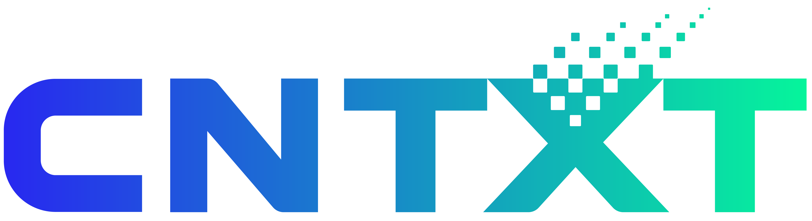

# Ahmad Zafar

## About Me

  Senior Software Developer (Go | Python | Node.js) @
   
  Cloud-native development | Architecture design | Microservices | Distributed systems | Kubernetes | gRPC | REST

### Summary

Results-oriented professional thriving in highly collaborative environments, adept at resolving challenges and focused on customer satisfaction. Experienced in building consumer-centric web applications with Go, Python, and Node.js, translating product needs into efficient backend systems and reliable integrations with APIs, third-party services, and databases.

## Socials

## Tech Stack

### Programming Languages & Runtime

### Architecture & Design

### APIs, Communication & Integration

### Backend Frameworks, Auth & Workflows

### Cloud, DevOps & CI/CD

### Databases & ORMs

### Messaging & Event Streaming

### Monitoring & Observability

### Large Language Models & AI

### Engineering Practices & Paradigms

